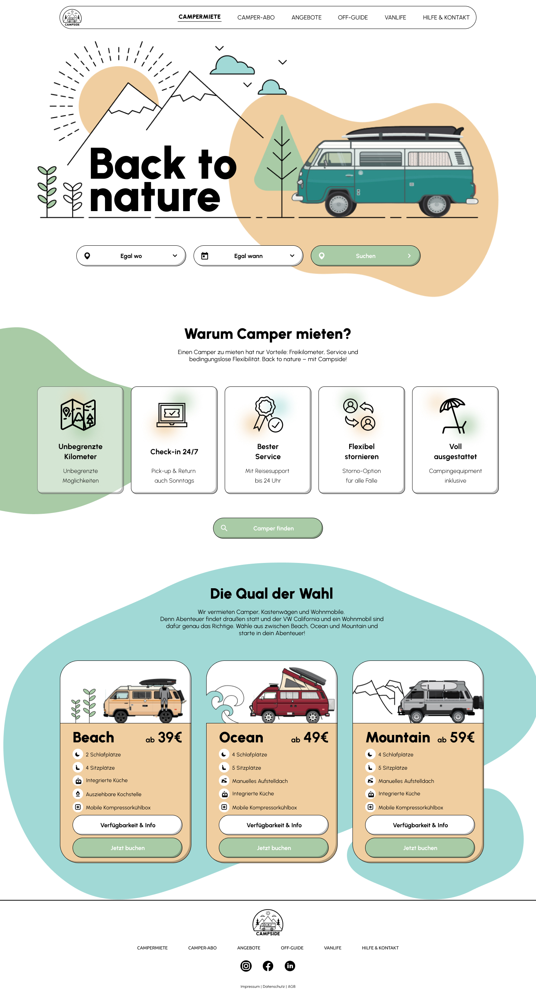
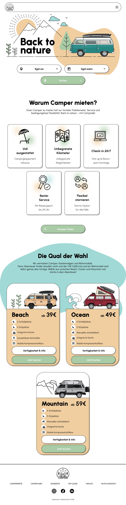
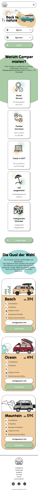

# Project Back to Nature

## Overview

**Project Back to Nature** is a responsive landing page designed using **SCSS/SASS** as a CSS Preprocessor.
This project focuses on utilizing key features of SASS like mixins and nesting, which helped simplify and organize the CSS structure.

## Live Website

You can view the live project here: [Project Back to Nature](https://manonsfoto.github.io/25_09_24_Project_Back_to_Nature/)

## Tech Stack

- **HTML5**: For structuring the webpage
- **SCSS/SASS**: CSS Preprocessor for more organized and maintainable styling
- **Responsive Design**: Built for Desktop, Tablet, and Mobile versions

## Time Taken

This project took approximately **10 hours** to complete.

## Key Features

- **SASS Mixins**: Created reusable code blocks for consistent styles across the project.
- **Nesting**: Simplified CSS by nesting rules inside one another for better readability and maintainability.
- **Responsive Design**: Optimized for different screen sizes including desktop, tablet, and mobile.

## Takeaways

This project was an exciting experience that introduced me to the power of **SASS**. Some of the key takeaways include:

- Learning how to use **mixins** allowed me to create my own shorthand for repetitive styles.
- **Nesting** made styling more intuitive and easier to manage.
- I am eager to dive deeper into SASS and explore its full potential to improve the efficiency and maintainability of CSS in future projects.

## Screenshots

### Desktop Version

### Tablet Version

### Mobile Version

---

# Project Back to Nature

## Überblick

**Project Back to Nature** ist eine responsive Landingpage, die mit **SCSS/SASS** als CSS-Präprozessor gestaltet wurde.
Dieses Projekt konzentriert sich auf die Anwendung von wichtigen SASS-Funktionen wie Mixins und Nesting, was die Struktur und Organisation des CSS-Codes vereinfacht hat.

## Live-Website

Hier kannst du das Projekt live ansehen: [Project Back to Nature](https://manonsfoto.github.io/25_09_24_Project_Back_to_Nature/)

## Tech-Stack

- **HTML5**: Zur Strukturierung der Webseite
- **SCSS/SASS**: CSS-Präprozessor für eine besser organisierte und wartbare Gestaltung
- **Responsive Design**: Entwickelt für Desktop-, Tablet- und Mobilansichten

## Zeitaufwand

Dieses Projekt hat ungefähr **10 Stunden** in Anspruch genommen.

## Hauptfunktionen

- **SASS Mixins**: Wiederverwendbare Codeblöcke wurden erstellt, um einheitliche Stile im gesamten Projekt zu verwenden.
- **Nesting**: Vereinfacht das Styling, indem Regeln ineinander verschachtelt wurden, um die Lesbarkeit und Wartbarkeit zu verbessern.
- **Responsive Design**: Optimiert für verschiedene Bildschirmgrößen, einschließlich Desktop, Tablet und Mobilgeräte.

## Erkenntnisse

Dieses Projekt hat mir viel Freude bereitet, da ich die Leistungsfähigkeit von **SASS** kennenlernen konnte.
Einige der wichtigsten Erkenntnisse umfassen:

- **Mixins** haben mir geholfen, eigene Abkürzungen für wiederkehrende Stile zu erstellen.
- **Nesting** hat das Styling intuitiver und einfacher zu verwalten gemacht.
- Ich freue mich darauf, mehr über SASS zu lernen und sein volles Potenzial auszuschöpfen, um CSS in zukünftigen Projekten effizienter und wartbarer zu gestalten.
